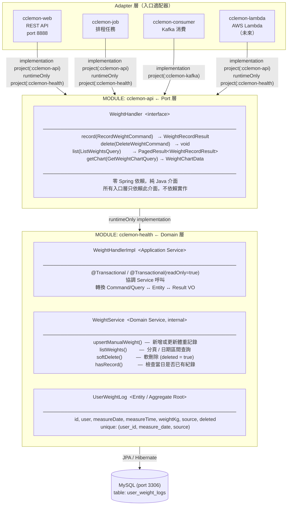

---

## DDD 核心用意

> 讓程式碼說「業務的語言」，不是「技術的語言」。  
> 業務邏輯集中，技術細節（HTTP / DB / Kafka / Lambda）向外推，邊界清楚。

---

## 各入口方案

| 入口 | 狀態 | 作法 |
|------|------|------|
| REST API (cclemon-web) | ✅ 已支援 | Controller 注入 WeightHandler 介面 |
| 排程 Job (cclemon-job) | ✅ 已支援 | Job 直接注入 WeightHandler，不需 HTTP |
| Kafka Consumer | ✅ 已支援 | 實作 KafkaMessageHandler，宣告 topic |
| AWS Lambda | 🔧 需新增模組 | Spring Cloud Function Adapter，Handler 介面不動 |
| Cloudflare Workers | ⚠️ 不直接支援 Java | Workers 透過 HTTP 呼叫 cclemon-web REST API |

---

## 設計原則

```
Handler 介面 (cclemon-api)  =  Port
  → 新增入口 = 新增 Adapter 模組，業務層完全不動

runtimeOnly 依賴策略
  implementation project(":cclemon-api")    // 編譯期只看介面
  runtimeOnly   project(":cclemon-health")  // 執行期注入實作
```
