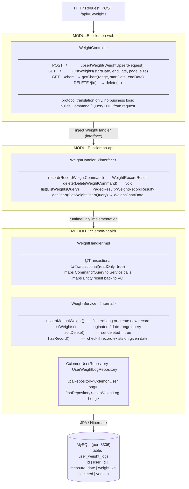

```mermaid
flowchart TD
    HTTP["HTTP Request: POST /api/v1/weights"]

    subgraph WEB["MODULE: cclemon-web"]
        CTRL["WeightController
        ───────────────────────────────────────────────────────
        POST   /        → upsertWeight(WeightUpsertRequest)
        GET    /        → listWeights(startDate, endDate, page, size)
        GET    /chart   → getChart(range, startDate, endDate)
        DELETE /{id}    → delete(id)
        ───────────────────────────────────────────────────────
        protocol translation only, no business logic
        builds Command / Query DTO from request"]
    end

    subgraph API["MODULE: cclemon-api"]
        HANDLER["WeightHandler  &lt;interface&gt;
        ───────────────────────────────────────────────────────
        record(RecordWeightCommand)   → WeightRecordResult
        delete(DeleteWeightCommand)   → void
        list(ListWeightsQuery)        → PagedResult&lt;WeightRecordResult&gt;
        getChart(GetWeightChartQuery) → WeightChartData"]
    end

    subgraph HEALTH["MODULE: cclemon-health"]
        IMPL["WeightHandlerImpl
        ───────────────────────────────────────────────────────
        @Transactional
        @Transactional(readOnly=true)
        maps Command/Query to Service calls
        maps Entity result back to VO"]

        SERVICE["WeightService  &lt;internal&gt;
        ───────────────────────────────────────────────────────
        upsertManualWeight()  —  find existing or create new record
        listWeights()         —  paginated / date-range query
        softDelete()          —  set deleted = true
        hasRecord()           —  check if record exists on given date"]

        REPO["CclemonUserRepository              UserWeightLogRepository
        JpaRepository&lt;CclemonUser, Long&gt;   JpaRepository&lt;UserWeightLog, Long&gt;"]
    end

    DB[("MySQL  (port 3306)
        table: user_weight_logs
        id | user_id | measure_date | weight_kg | deleted | version")]

    HTTP                        --> WEB
    WEB  -- "inject WeightHandler (interface)"  --> API
    API  -- "runtimeOnly implementation"        --> HEALTH
    HEALTH -- "JPA / Hibernate"                 --> DB
```
